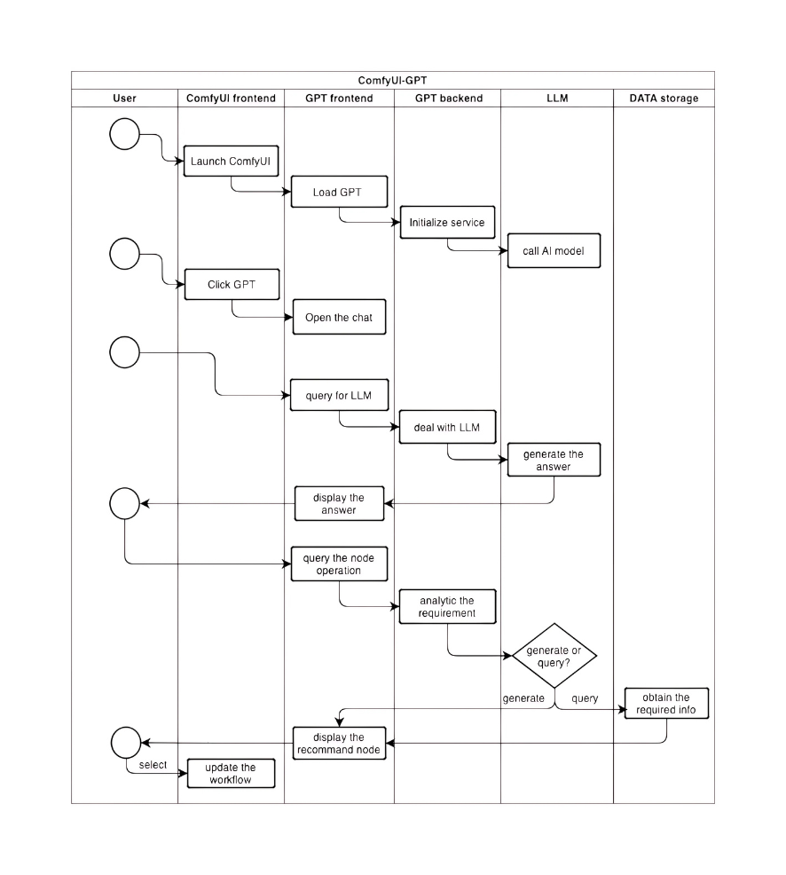

# ComfyUI-GPT
Help comfy deisgner develope custom nodes by foreground GUI without any coding knowledge, complementing the workflow what you design with LLM automatically 

## Project Description
ComfyUI-GPT is a intelligent assistant based on ComfyUI framework, and aim to simplify and enhance the comfyui workflow design process with LLM. It provides the custom node recommandation, workflow building assistance, and query service for the comfyui community to make the development more efficient and enjoyable.

## swim lane diagram

## Functions Enum

- [ ] General Chat With ComfyUI
- [ ] Workflow Query and Load 
- [ ] Make Custom node automatically
- [ ] Parameter Fine-tuning
- [ ] Support secondary development
- [ ] Model Relationships and Associations 
- [ ] Node Introduction
- [ ] Workflow arrangement
- [ ] Workflow Optimization
